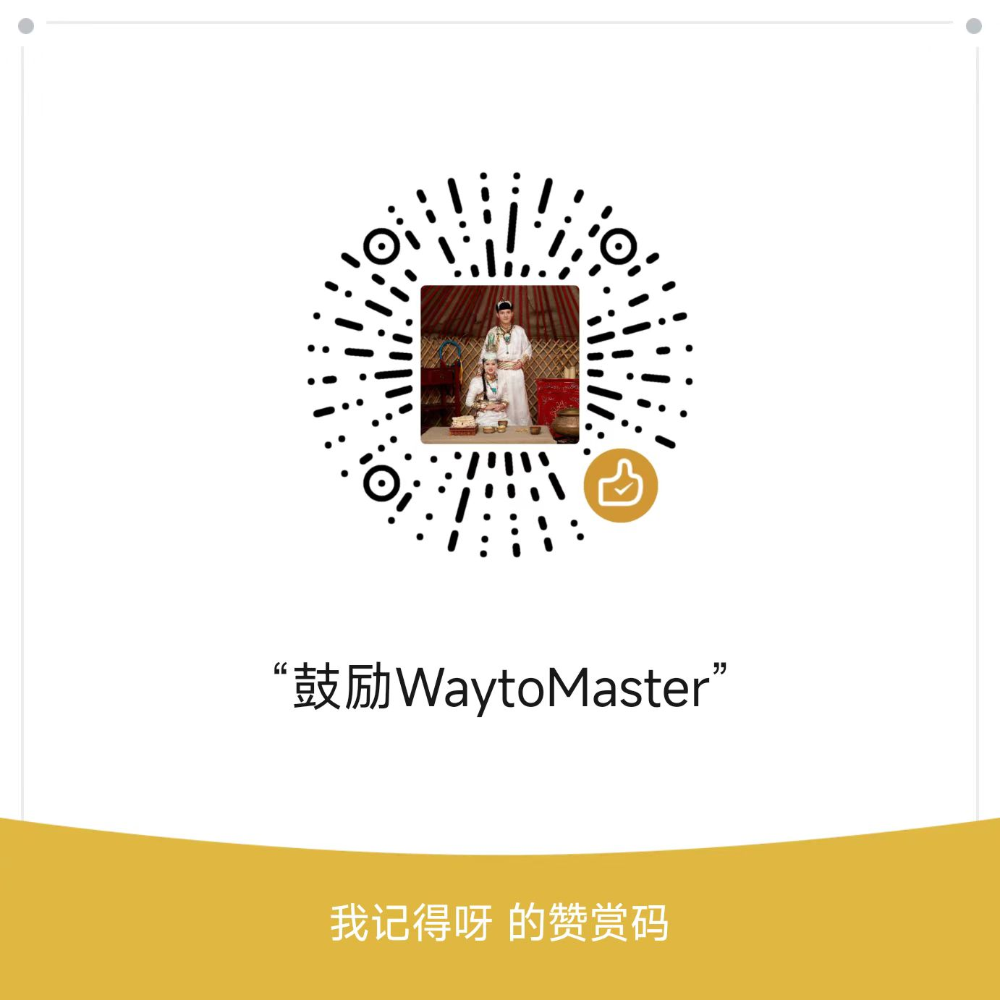

<div align="center">

# Content Distiller

### 蒸馏内容创作者的思维体系和方法论 | AI驱动知识提炼 | 完全开源

**体系化提炼 | 断点续传 | 智能分批 | 成本友好 | 高度可配置**

[](https://github.com/tmwgsicp/content-distiller/stargazers)
[](LICENSE)
[](https://www.python.org/)

> **100% 开源，完全免费。** 代码完全公开，私有化部署无任何限制。

</div>

---

## 项目简介

**Content Distiller** 是一个智能内容蒸馏工具，它能将大量零散的文章（博客、公众号、RSS订阅等）提炼成**体系化的知识文档**。

### 核心特点

- 🎯 **体系化提炼**：不是简单摘要，而是提取思维模型和方法论
- 🔄 **断点续传**：中途中断可继续，节省时间
- 🧠 **智能分批**：自动优化批次，充分利用AI上下文窗口
- ⚙️ **高度可配置**：提示词、分类规则、输出格式都可自定义
- 💰 **成本友好**：支持 Qwen/DeepSeek 等性价比 API

### 适用场景

- 📚 学习某个博主/专家的完整知识体系
- 💼 整理行业资讯形成结构化洞察
- 🎓 将课程资料提炼成学习笔记
- 📝 把个人文章整理成知识库
- 🔗 **支持多RSS源**：同时订阅多个博主/网站，统一蒸馏

## 快速开始

### 前置要求

1. **Python 3.8+**
2. **RSS源**（任意标准RSS）：
   - [ForgeRSS](https://github.com/tmwgsicp/ForgeRSS) - 开源RSS工具
   - [wechat-download-api](https://github.com/tmwgsicp/wechat-download-api) - 微信公众号RSS订阅
   - Feedly, Inoreader - RSS聚合服务
   - 博客、新闻网站的原生RSS

3. **LLM API**（任选其一）：
   - [通义千问 Qwen](https://dashscope.aliyun.com/) - 推荐
   - [DeepSeek](https://platform.deepseek.com/)

### 一键配置（推荐）

```bash
# 1. 克隆项目
git clone https://github.com/tmwgsicp/content-distiller.git
cd content-distiller

# 2. 安装依赖
pip install -r requirements.txt

# 3. 运行配置向导
python setup.py
```

配置向导会引导你完成：
- ✅ 选择LLM服务
- ✅ 输入API Key
- ✅ 配置RSS链接
- ✅ 设置输出目录

### 🎯 关键步骤：自定义配置

**在运行前，强烈建议先编辑 `prompts.yaml`：**

```bash
# 根据你的内容源修改配置
vim prompts.yaml  # 或使用任意编辑器

# 参考技术博客配置示例
cat prompts.example.yaml
```

**需要自定义的内容：**
1. **分类规则** - 修改 `categories` 部分的关键词
2. **提示词** - 修改各分类的提取策略
3. **参数调优** - 调整 `temperature`、`max_tokens` 等

> 💡 **重要提示**：默认配置是针对投资/育儿/个人成长类内容设计的。如果你的内容源不同（如技术博客、行业资讯），**必须修改** `prompts.yaml` 才能获得最佳效果！查看 `prompts.example.yaml` 了解技术类内容的配置示例。

### 手动配置

如果你喜欢手动配置：

```bash
# 1. 复制配置模板
cp .env.example .env

# 2. 编辑 .env 文件
# QWEN_API_KEY=your_key_here
# RSS_FEED_URLS=url1,url2,url3  # 支持多个RSS源，用逗号分隔
```

### 开始蒸馏

```bash
# 完整运行
python distill.py

# 测试运行（只处理10篇）
python distill.py --limit 10

# 使用 DeepSeek 模型
python distill.py --model deepseek
```

## 核心功能

### ✨ 断点续传

即使中途中断（网络问题、API余额不足等），也能从断点继续：

```bash
# 程序中断后，直接运行相同命令
python distill.py  # 自动从上次中断处继续
```

- ✅ 自动保存每个批次的处理结果
- ✅ 重启时自动检测缓存
- ✅ 只处理未完成的部分
- ✅ 节省API调用成本

### 🎯 智能分批

自动优化批次大小，充分利用AI上下文窗口：

- 动态计算每批文章数量（基于token统计）
- 支持128K上下文窗口
- 批次结果独立保存

### 📚 体系化输出

提炼思维体系，不是简单摘要。根据你的配置生成对应分类的知识文档：

```
output/
├── {分类名}.md              # 体系化知识文档（10-20KB）
├── {分类名}-原文合集.md      # 完整原文备查
├── {另一个分类}.md
├── {另一个分类}-原文合集.md
└── INDEX.md                 # 总索引
```

**示例（投资/育儿内容）：**
- `投资体系.md` - 提炼的投资理念和方法论
- `育儿理念.md` - 育儿经验和教育方法

**示例（技术博客内容）：**
- `后端技术.md` - 后端开发知识体系
- `架构设计.md` - 系统架构设计思想

### ⚙️ 高度可配置

所有配置都在 **`prompts.yaml`** 中，无需修改代码：

**1. 自定义分类规则**

```yaml
categories:
  技术:  # 自定义分类名
    keywords: ["Python", "Docker", "API", "前端", "后端"]
    prompt_key: "tech"  # 对应的提示词
  
  产品:
    keywords: ["产品设计", "用户体验", "需求分析"]
    prompt_key: "product"
```

**2. 自定义提示词**

```yaml
investment:  # 对应 prompt_key
  system: |
    你是一位资深投资分析师...
    [根据你的需求修改提取策略]

tech:  # 新增的提示词
  system: |
    你是一位资深技术专家...
    请提取技术要点、实践经验、踩坑记录...
```

**3. 调整参数**

```yaml
settings:
  max_article_length: 0      # 0=完整文章，3000=前3000字
  batch_temperature: 0.3     # 越低越忠实原文（0.1-0.8）
  synthesis_temperature: 0.2 # 整合温度
  max_tokens: 8000           # 单次输出最大长度
```

**参数说明：**
- `temperature` (0.1-0.8)：越低越保守，越高越有创意
- `max_article_length`：0=完整文章，其他值=截取字符数（控制成本）
- `max_tokens`：单次AI输出的最大token数

## MVP 功能

- [x] RSS 文章导入（历史 + 日常更新）
- [x] 内容清洗和预处理
- [x] 智能分类（基于关键词，可自定义）
- [x] AI 知识合成（DeepSeek/Qwen）
- [x] 体系化整理（生成 Markdown）
- [x] 断点续传（应对中断）
- [x] 原文合集（方便查找）
- [x] 完全可配置（分类、提示词、参数）

## 输出结构

根据你在 `prompts.yaml` 中定义的分类，生成对应的知识文档：

```
output/
├── INDEX.md                    # 总索引
├── {分类1}.md                  # 体系化知识（10-20KB）
├── {分类1}-原文合集.md          # 所有原文整合
├── {分类2}.md
├── {分类2}-原文合集.md
└── {其他分类}.md
```

**实际示例（根据你的配置而定）：**
- 投资内容 → `投资体系.md` + `投资体系-原文合集.md`
- 技术博客 → `后端技术.md` + `前端技术.md` + `架构设计.md`

## 使用建议

### 学习路径

1. **快速入门**：先阅读体系化文档（如 `{分类名}.md`）
2. **深度学习**：对某个观点感兴趣？在 `{分类名}-原文合集.md` 中搜索关键词
3. **个性化笔记**：直接在Markdown中添加你的批注和思考

### 成本优化

- 使用 `--limit` 参数先测试效果
- 开启断点续传，避免重复处理
- 调整 `prompts.yaml` 中的 `max_article_length`（默认0=处理完整文章）

## 技术栈

- **语言**：Python 3.8+
- **AI服务**：Qwen / DeepSeek
- **依赖**：feedparser, tiktoken, click, rich, beautifulsoup4
- **架构**：两阶段提取（批次提取 → 知识整合）

## 开发路线

- ✅ **阶段1**：CLI工具、断点续传、智能分批
- 🔄 **阶段2**：三层知识体系、Skill导出、向量检索
- 📅 **阶段3**：对话式数字顾问、SaaS化

## 常见问题

### 使用相关

**Q: 程序中途中断了怎么办？**  
A: 直接运行相同命令继续，已处理的部分会自动跳过。

**Q: 如何完全重新开始？**  
A: 运行 `python distill.py --clear-cache` 清除所有缓存。

**Q: 处理400篇文章需要多久？**  
A: 约20-30分钟，取决于网络速度和API响应。

**Q: API调用失败怎么办？**  
A: 程序会自动重试3次，失败后可继续运行相同命令恢复。

### 成本相关

**Q: 大概需要多少成本？**  
A: 成本取决于多个因素：
- 文章数量和长度
- 选择的LLM服务（Qwen或DeepSeek）
- `max_article_length` 配置（是否截取文章）
- API价格（会随时间调整）

建议：先用 `--limit 10` 测试，观察实际消耗，再决定是否批量处理。国产大模型（Qwen/DeepSeek）价格通常很实惠。

**Q: 如何控制成本？**  
A: 
- 先用 `--limit 10` 测试效果
- 调整 `prompts.yaml` 中的 `max_article_length`
- 使用断点续传避免重复处理

### 内容相关

**Q: 支持哪些内容源？**  
A: 任何标准的RSS 2.0 / Atom格式，包括：
- ForgeRSS（自建RSS）
- wechat-download-api（微信公众号RSS订阅）
- 博客RSS、新闻RSS
- Feedly、Inoreader等聚合服务

**Q: 我的内容不是投资/育儿类，如何配置？**  
A: **必须自定义 `prompts.yaml`！** 按照以下步骤：
1. 修改 `categories` 部分，添加你的分类和关键词
2. 添加对应的提示词（如 `tech:`、`product:` 等）
3. 在分类配置中设置 `prompt_key` 关联到你的提示词
4. 运行测试：`python distill.py --limit 5` 验证效果

**Q: 如何自定义提取策略？**  
A: 编辑 `prompts.yaml` 文件，可以：
- 修改系统提示词
- 调整温度参数
- 设置文章处理长度（默认完整文章）
- 添加新的内容分类

**Q: 输出质量不满意怎么办？**  
A: 
1. 优化 `prompts.yaml` 中的提示词
2. 降低temperature参数（更保守）
3. 确认 `max_article_length: 0`（处理完整文章）
4. 调整分类关键词，确保分类准确

### 法律相关

**Q: 版权问题如何处理？**  
A: 本工具仅提供技术服务，用户需：
- 确保内容来源合法
- 蒸馏结果仅供个人学习
- 不得用于商业用途
- 尊重原作者版权

详见 [法律声明](LEGAL.md)。

---

## 参与贡献

由于个人精力有限，**暂不接受代码合并请求（Pull Request）**，但非常欢迎：

### ✅ 欢迎的贡献方式

- **提交 Issue** — 报告 Bug、提出功能建议、贡献新的提示词配置
- **Fork 项目** — 自由修改和定制
- **Star 支持** — 给项目点 Star，让更多人看到

### 如何提交 Issue

**Bug 报告：**
- 清晰描述问题
- 提供复现步骤
- 包含环境信息（OS、Python版本、使用的LLM）
- 粘贴错误日志

**功能建议：**
- 说明使用场景
- 描述期望功能
- 解释为什么需要

---

## 相关项目

- **[ForgeRSS](https://github.com/tmwgsicp/ForgeRSS)** - 将任意网站转换为 RSS 订阅源，支持多引擎抓取
- **[wechat-download-api](https://github.com/tmwgsicp/wechat-download-api)** - 微信公众号文章获取 & RSS 订阅服务

---

## 开源协议

本项目采用 **AGPL 3.0** 协议开源，**所有功能代码完整公开，私有化部署完全免费**。

| 使用场景 | 是否允许 |
|---------|---------|
| 个人学习和研究 | ✅ 允许，免费使用 |
| 企业内部使用 | ✅ 允许，免费使用 |
| 私有化部署 | ✅ 允许，免费使用 |
| 修改后对外提供网络服务 | ⚠️ 需开源修改后的代码 |

详见 [LICENSE](LICENSE) 文件。

---

## 免责声明

- 本软件按"原样"提供，不提供任何形式的担保
- 本项目仅供学习和研究目的，请遵守相关网站的服务条款
- 使用者对自己的操作承担全部责任
- 因使用本软件导致的任何损失，开发者不承担责任

---

## 联系方式

<table>
  <tr>
    <td align="center">
      <br>
      <b>个人微信</b><br>
      <em>技术交流 / 商务合作</em>
    </td>
    <td align="center">
      <br>
      <b>赞赏支持</b><br>
      <em>开源不易，感谢支持</em>
    </td>
  </tr>
</table>

- **GitHub Issues**: [提交问题](https://github.com/tmwgsicp/content-distiller/issues)
- **邮箱**: creator@waytomaster.com

---

## 致谢

- [feedparser](https://github.com/kurtmckee/feedparser) — 强大的 RSS/Atom 解析库
- [tiktoken](https://github.com/openai/tiktoken) — OpenAI 的 Token 计数工具
- [click](https://github.com/pallets/click) — Python CLI 工具框架
- [rich](https://github.com/Textualize/rich) — 精美的终端输出库
- [BeautifulSoup](https://www.crummy.com/software/BeautifulSoup/) — HTML 解析和清洗
- [PyYAML](https://github.com/yaml/pyyaml) — YAML 配置文件解析
- [Qwen](https://dashscope.aliyun.com/) & [DeepSeek](https://platform.deepseek.com/) — 提供优质的 LLM API 服务

---

## Star History

如果这个项目对你有帮助，请给个 ⭐️！

[](https://star-history.com/#tmwgsicp/content-distiller&Date)

---

Made with ❤️ by [tmwgsicp](https://github.com/tmwgsicp)
